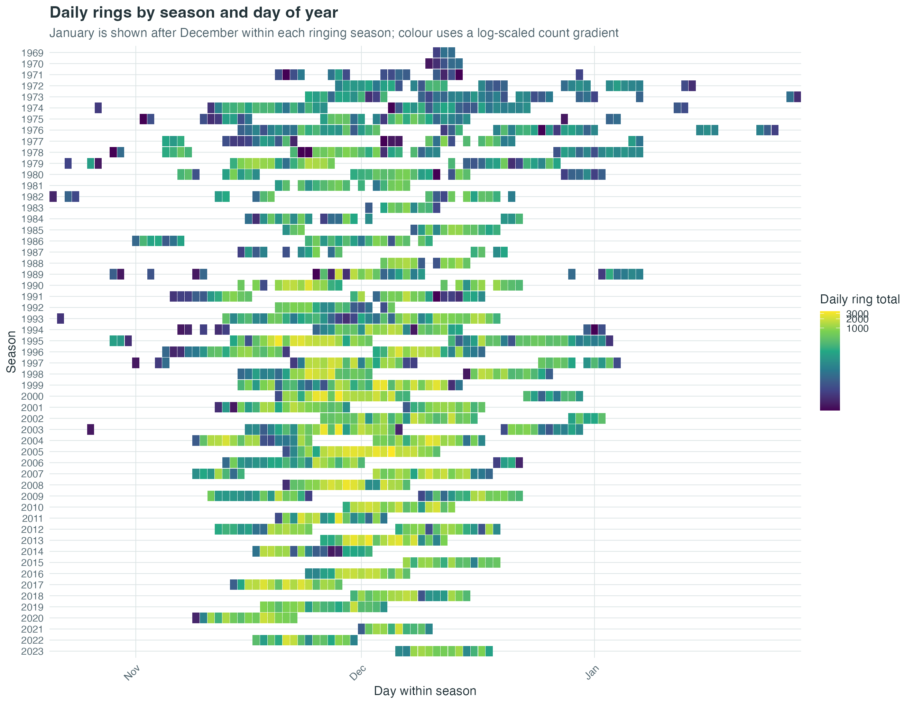

# Ngulia ringing dataset

Research data and reproducible processing workflows for the Ngulia ringing project.

The project website is maintained in a separate repository.

## Authors and contributor roles

Roles describe contributions to this curated dataset and are a project-maintained attribution record.

| Creator | Roles |
| --- | --- |
| Colin Jackson | Project leadership; Historical data stewardship; Field data collection; Data validation |
| Raphaël Nussbaumer | Data curation; Software; Methodology; Validation; Documentation |
| Martin Cade | Project coordination; Field data collection; Data validation |
| Graeme C. Backhurst | Founding project leadership; Historical data collection; Methodology |
| David J. Pearson | Founding project leadership; Historical data collection; Methodology |

## Project guide

- [Dataset documentation](docs/dataset.md): files, data dictionary, processing, and run order.
- [Publication status](docs/publication.md): Zenodo and GBIF preparation and record checks.
- [Dataset exploration](scripts/exploration/dataset_overview/): descriptive tables and figures.
- [Data limitations](docs/data_limitations.md): interpretation limits for catch, effort, and historical covariates.
- [Daily covariate evidence](config/daily_covariates/README.md): operations-history structure and evidence rules.
- [Field protocol planning](docs/planning/field_protocol.md): future measurements and standardisation.

## Dataset overview

The figure shows recorded daily ringing totals by season. Blank dates are not assumed to be zero-catch days; see the coverage table before interpreting gaps.

Regenerate this figure with `scripts/exploration/dataset_overview/01_plot_daily_rings_by_season.R` and copy the reviewed result from `outputs/exploration/dataset_overview/figures/` to `assets/generated/`.

## Repository layout

`data/01_raw/` holds source material; `data/02_reference/` holds reference material; `data/03_intermediate/` holds regenerable staging products; and `data/04_curated/` holds analysis-ready datasets. Scripts progress through `scripts/curated/`, `scripts/intermediate/`, `scripts/exploration/`, `scripts/diagnostics/`, and `scripts/exports/`. Generated exploration and QA products are written under `outputs/`; delivery formats under `exports/`.

Question-specific research is maintained in [ngulia-analysis](https://github.com/A-Rocha-Kenya/ngulia-analysis). The [Ngulia website](https://a-rocha-kenya.github.io/ngulia-website/) is the public project entry point; the [forecast](https://a-rocha-kenya.github.io/ngulia-forcast/) is a separate tool. Zenodo and GBIF publication records are in preparation. Source collections and regenerated products are not tracked in Git.
